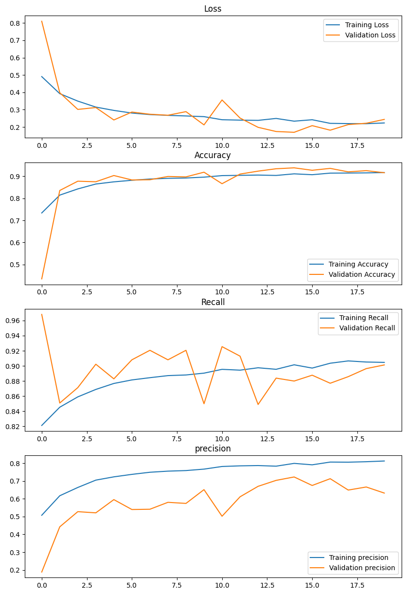
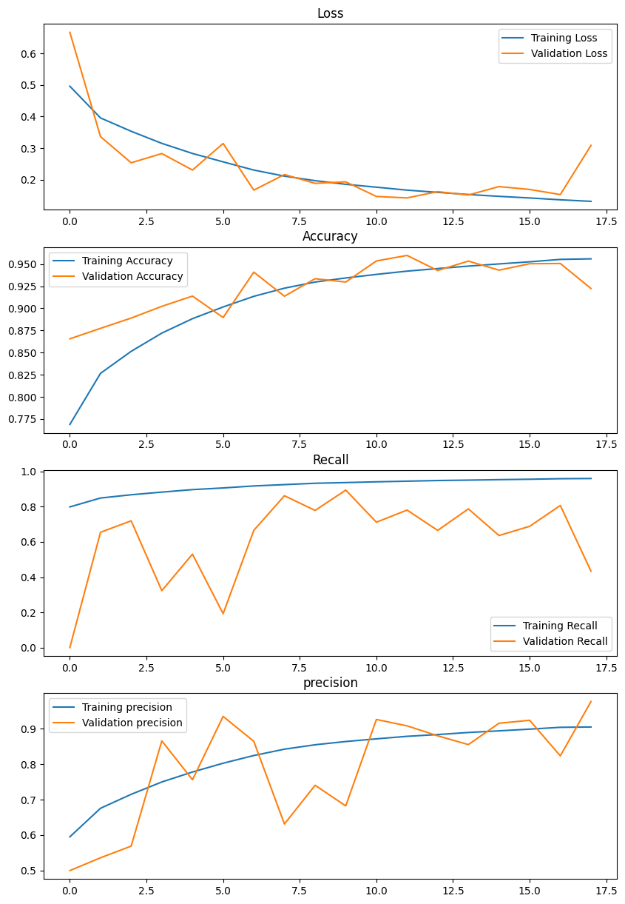

# MammographyAI

#### Open in Google Colab

| InceptionV1 Notebook | InceptionV3 Notebook |
|:---------------------:|:---------------------:|
|  |  |

## Project Summary

This project focuses on healthcare cancer detection, emphasizing the importance of early and accurate detection of malignant cases. The primary metric for evaluation is recall, as it is crucial to always catch cancer when it is present. Precision, loss, and accuracy are also recorded but are secondary to recall.

### Key Sections

#### Measurement
- **Importance of Recall**: High recall is prioritized to ensure malignant cases are detected.
- **Metrics Recorded**: Loss, recall, precision, and accuracy.

#### Results Analysis, Intuitions, and Comparison
- **Model States Saved**:
  1. The latest model
  2. The model with the lowest loss
  3. The model with the highest recall
- **Model Selection**: The model with the highest recall is chosen for future testing.
- **Performance Metrics**: Validation results and performance metrics for the best model are compared using the test dataset.

#### Handling Imbalanced Dataset
- **Data Duplication**: Duplicated the number of images that had cancer.
- **Class Weights Adjustment**: Adjusted weights for classes to focus more on detecting minority class cases.

### Training Performance

The following graphs illustrate the training performance of the InceptionV1 and InceptionV3 models, showing the trends in loss, recall, precision, and accuracy over the training epochs.

| InceptionV1 Training Graphs | InceptionV3 Training Graphs |
|:---------------------------:|:---------------------------:|
|  |  |

### Conclusion

In this project, a machine learning model based on the GoogLeNet architecture was developed to detect cancer. This model achieved high recall and accuracy, matching the performance of top models in the field.
